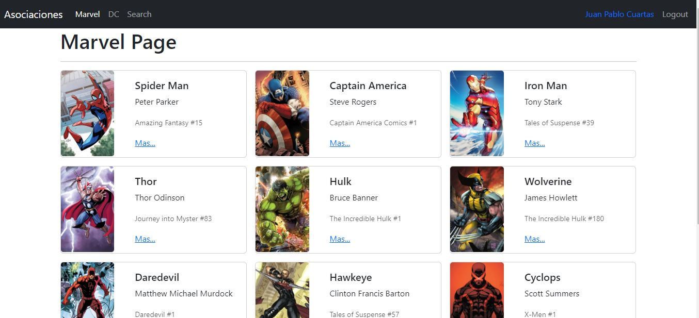
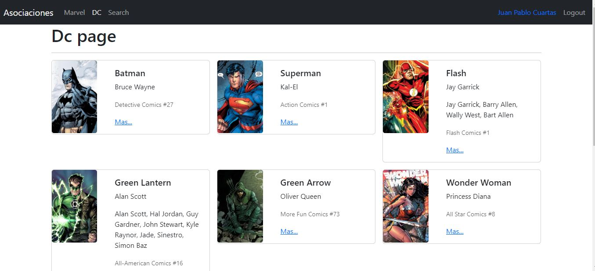
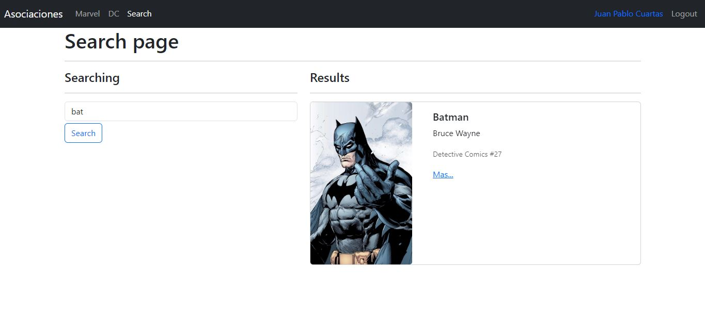

# Heroes spa App - Practicing React.
-Website [Heroes-spa-app](https://heroes-app-juanpa88842.netlify.app/login)

## Table of contents

- [Overview](#overview)
  - [The challenge](#the-challenge)
  - [Screenshot](#screenshot)
- [My process](#my-process)
  - [Built with](#built-with)
  - [What I learned](#what-i-learned)
- [Author](#author)

## Overview

### The challenge

A page for superheroes was created to review some React concepts such as:

-Single Page Application (SPA)
-Query parameters and filters
-Private and public routes

### Screenshot

## My process
The project began by creating the access routes, building a list of heroes based on their respective categories. Next, the individual hero cards and their information were designed for display. Later, a search screen was implemented, and both public and private routes were set up for each screen. Finally, localStorage was utilized to preserve the session state in case a user logged out and then logged back in, and some animations were added.

### Built with

- React.js
- [Query-String](https://www.npmjs.com/package/query-string) - npm library
- [Netlify](https://heroes-app-juanpa88842.netlify.app/marvel) - Deployed

### What I learned

I learned how to use query parameters, especially how to read the data with a very useful library called query string. I really liked the design of the routes as it is quite robust and functional, something I will definitely continue to use in my future projects. I also want to highlight the use of useMemo to store values and avoid re-rendering the page, the use of useContext to access the global state of the login variable, and the use of useLocation to get the current location object and access properties like pathname and search.

## Author

- LinkedIn - [Juan Pablo Cuartas](https://www.your-site.com)
- Email - [juanpa88842@gmail.com](https://www.linkedin.com/in/juanpablocuartas/)

